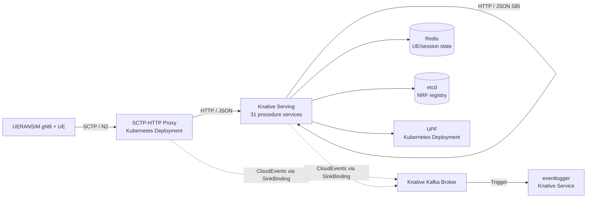

# Serverless5GC on Knative

Serverless5GC is a serverless 5G core network implementation using Procedure-as-a-Function decomposition on Knative. It maps 31 individual 3GPP procedures across 12 network functions (Release 15-17) to independent Knative Services that can scale to zero when idle.

**Paper:** [Serverless5GC: Private 5G Core Deployment via a Procedure-as-a-Function Architecture](https://arxiv.org/abs/2603.27618)

## Architecture

Each 3GPP procedure is packaged as a standalone HTTP container and deployed as a Knative Service. NF identity remains logical: for example, the AMF is a set of procedure services that share UE/session state in Redis.



## What Runs Where

Knative resources:

- 31 procedure functions as `serving.knative.dev/v1` Services.
- `eventlogger` as a Knative Service.
- Kafka-backed `eventing.knative.dev/v1` Broker.
- Trigger from the Broker to `eventlogger`.
- SinkBindings that inject `K_SINK` into procedure services and the SCTP proxy.

Kubernetes-native resources:

- Redis for UE/session/subscriber state.
- etcd for NRF registry state.
- UPF for PFCP/GTP-U.
- SCTP proxy for NGAP/SCTP on NodePort `31412`, forwarding to pod port `38412`.

## Runtime Changes

- Procedure handlers now use the local `pkg/function` runtime instead of an external FaaS SDK.
- Inter-procedure SBI calls use Knative service DNS by default:
  `http://<function>.<namespace>.svc.<cluster-domain>`.
- `FUNCTION_URL_TEMPLATE` can override the URL pattern. It must contain one `%s` placeholder.
- Function containers expose `/healthz` and `/metrics`.
- Invocation metrics are exported as:
  `serverless5gc_function_invocations_total`
  and `serverless5gc_function_duration_seconds`.
- When `K_SINK` is injected by SinkBinding, procedure services emit best-effort CloudEvents to the Kafka Broker.

## Images

The default image registry is:

```text
ghcr.io/atnog/serverless5gc-knative
```

Internal images:

- `ghcr.io/atnog/serverless5gc-knative/<procedure>:latest`
- `ghcr.io/atnog/serverless5gc-knative/sctp-proxy:latest`
- `ghcr.io/atnog/serverless5gc-knative/eventlogger:latest`

External images still used by native Kubernetes manifests:

- `redis:7-alpine`
- `quay.io/coreos/etcd:v3.5.12`
- `free5gc/upf:v4.2.0`

## Prerequisites

- Kubernetes or K3s with SCTP support enabled.
- `kubectl` configured for the target cluster.
- Docker or a compatible image builder.
- A Kafka cluster reachable from the Knative Kafka Broker.
- Knative Serving, Knative Eventing, and Knative Kafka Broker installed.
- `gtp5g` kernel module loaded on every node that may run the UPF.
- `/dev/net/tun` available on the UPF node. The UPF manifest mounts it and runs the UPF container privileged because the free5GC UPF creates GTP interfaces.

Prepare every node that may run the UPF:

```bash
sudo scripts/install-upf-node-prereqs.sh
```

For Arch-family nodes, including EndeavourOS, the script installs `base-devel`, `git`, `kmod`, and the matching kernel headers package. For Debian/Ubuntu nodes, it installs `build-essential`, `git`, `kmod`, and `linux-headers-$(uname -r)`.

The helper install script installs Knative Serving, Kourier, Eventing, and the Kafka Broker implementation. It does not install a Kafka cluster.

```bash
scripts/install-knative.sh
```

The default script version is `knative-v1.22.1`. Override versions when needed:

```bash
KNATIVE_VERSION=knative-v1.22.1 \
KAFKA_BROKER_VERSION=knative-v1.22.1 \
scripts/install-knative.sh
```

## Build Images

Build all 31 procedure images plus `sctp-proxy` and `eventlogger`:

```bash
deploy/knative/build-images.sh
```

Build and push to GHCR:

```bash
docker login ghcr.io
deploy/knative/build-images.sh \
  --registry ghcr.io/atnog/serverless5gc-knative \
  --tag latest \
  --push
```

Equivalent Make target:

```bash
make build-images
```

## Deploy

Deploy Redis, etcd, UPF, SCTP proxy, Knative Services, Broker, Triggers, and SinkBindings:

```bash
KAFKA_BOOTSTRAP_SERVERS=my-cluster-kafka-bootstrap.kafka:9092 \
scripts/deploy-knative.sh
```

Defaults:

- `REGISTRY=ghcr.io/atnog/serverless5gc-knative`
- `TAG=latest`
- `NAMESPACE=default`
- `CLUSTER_DOMAIN=cluster.local`
- `KAFKA_BOOTSTRAP_SERVERS=my-cluster-kafka-bootstrap.kafka:9092`

Check readiness:

```bash
kubectl get ksvc
kubectl get broker,trigger,sinkbinding
kubectl get deploy,pod,svc
```

The SCTP/N2 endpoint is exposed as NodePort `31412` by the `sctp-proxy` Service, forwarding to NGAP/SCTP port `38412` in the pod. Point UERANSIM gNB `amfConfigs[].address` to a cluster node IP and `port` to `31412`.

If the UPF enters `CrashLoopBackOff` with empty logs, inspect pod events first:

```bash
kubectl describe pod -l app=upf
kubectl get pod -l app=upf -o wide
```

On the selected node, verify:

```bash
lsmod | grep gtp5g
test -c /dev/net/tun
```

If `/dev/net/tun` is missing, load the kernel module:

```bash
sudo modprobe tun
```

If `gtp5g` is missing, run the node prep script on that node and restart the UPF deployment:

```bash
sudo scripts/install-upf-node-prereqs.sh
kubectl rollout restart deployment/upf -n default
```

## Deploy With SAF Firewall Protection

This repository also includes a SAF-protected Knative deployment model in
`deploy/saf`. It deploys the same Serverless5GC procedure functions, but each
Knative Service is annotated for the Serverless Application Firewall queue-proxy
with rules tailored to that service's 5GC procedure payload.

The SAF deployment protects all Knative Services:

- 31 procedure services.
- `eventlogger`.

The Kubernetes-native workloads stay unchanged and are not SAF-protected:
Redis, etcd, UPF, and the SCTP proxy.

Prerequisite: Knative Serving must use a SAF-capable queue-proxy image. The
helper script patches Knative Serving automatically by default:

```bash
deploy/saf/deploy-saf.sh
```

Default images:

- SAF queue-proxy:
  `ghcr.io/atnog/serverless-workflow-firewall/queue:latest`
- Serverless5GC functions:
  `ghcr.io/atnog/serverless5gc-knative/<image>:latest`

Override them when needed:

```bash
QUEUE_PROXY_IMAGE=ghcr.io/atnog/serverless-workflow-firewall/queue:latest \
REGISTRY=ghcr.io/atnog/serverless5gc-knative \
TAG=latest \
KAFKA_BOOTSTRAP_SERVERS=my-cluster-kafka-bootstrap.kafka:9092 \
deploy/saf/deploy-saf.sh
```

If Knative Serving is already patched to use SAF:

```bash
PATCH_SAF_QUEUE_PROXY=false deploy/saf/deploy-saf.sh
```

The policies are defined in `deploy/saf/policies.json`, rendered by
`deploy/saf/render-services.py`, and documented in `deploy/saf/README.md`.
They include service-specific semantic checks and strict top-level JSON body
allowlists, so unexpected request parameters are rejected before reaching the
function.

Generate the number of SAF request rules per Knative Service:

```bash
deploy/saf/policy-rule-counts.py --output deploy/saf/policy-rule-counts.csv
```

Verify the protected services:

```bash
kubectl get ksvc -l serverless5gc.knative.dev/saf-protected=true
scripts/smoke-test-knative.sh
```

## Smoke Test

Run a basic in-cluster subscriber write and authentication initiation:

```bash
scripts/smoke-test-knative.sh
```

The smoke test uses `curlimages/curl`. Override it if your cluster uses a private mirror:

```bash
TEST_IMAGE=registry.local/curl:latest scripts/smoke-test-knative.sh
```

Inspect event delivery:

```bash
kubectl logs -l serving.knative.dev/service=eventlogger -c user-container --since=10m
```

## Provision Subscribers

For external provisioning through Knative ingress:

```bash
KNATIVE_DOMAIN=example.com \
KNATIVE_HTTP_PORT=80 \
eval/scripts/provision-subscribers.sh <knative-ingress-ip> 1000
```

For an in-cluster or port-forwarded direct URL:

```bash
FUNCTION_URL=http://udr-data-write.default.svc.cluster.local \
FUNCTION_HOST=udr-data-write.default.svc.cluster.local \
eval/scripts/provision-subscribers.sh 127.0.0.1 1000
```

## Run Evaluation

For Knative-only evaluation inside the Kubernetes cluster, install the bundled
Prometheus first:

```bash
scripts/install-monitoring.sh
```

This creates a `monitoring` namespace with Prometheus exposed at:

- in-cluster: `http://prometheus.monitoring.svc.cluster.local:9090`
- NodePort: `http://<node-ip>:30175`

It scrapes procedure function `/metrics` endpoints and kubelet cAdvisor metrics.

Run a single cluster-local HTTP evaluation without an external load generator VM:

```bash
eval/scripts/run-knative-cluster-eval.sh low 1
```

Results are written to:

```text
eval/results/serverless-cluster/<scenario>/run<run>/
```

Run the full Knative evaluation suite and generate the report:

```bash
python3 -m pip install -r eval/analysis/requirements.txt
RUNS=1 eval/scripts/run-knative-evaluation-suite.sh
```

The suite runs `idle`, `low`, `medium`, `high`, and `burst` by default. Override
the set or duration when iterating:

```bash
SCENARIOS="low burst" EVAL_DURATION_MINUTES=2 RUNS=1 \
  eval/scripts/run-knative-evaluation-suite.sh
```

For small clusters, the `burst` scenario can temporarily saturate the API server
or Knative control plane. The evaluator gives jobs an extra 15 minutes by
default before failing. Increase that headroom if needed:

```bash
SCENARIOS="burst" EVAL_WAIT_EXTRA_SECONDS=1800 RUNS=1 \
  eval/scripts/run-knative-evaluation-suite.sh
```

If a run times out, diagnostics are saved in that run directory as
`loadgen.log`, `job.describe.txt`, and `pods.txt`.

The reporting step is a single seaborn-based Python script:

```bash
python3 eval/analysis/seaborn_report.py eval/results
```

It writes:

- `eval/results/summary.csv`
- `eval/results/function_metrics.csv`
- PNG charts in `eval/results/charts/`

### Compare SAF Flow Latency

To measure the latency overhead introduced by SAF on a representative
Serverless5GC execution flow, use:

```bash
python3 -m venv .venv
. .venv/bin/activate
python -m pip install -r eval/analysis/requirements.txt

BASELINE_QUEUE_PROXY_IMAGE=<standard-knative-queue-image> \
MODES="baseline SAF" \
FLOW_PROFILE=smf \
ITERATIONS=30 \
WARMUP=5 \
eval/scripts/compare-saf-flow-latency.sh
```

Use `FLOW_PROFILE=relay` to measure the AMF-to-SMF relay chain instead:

```bash
BASELINE_QUEUE_PROXY_IMAGE=<standard-knative-queue-image> \
MODES="baseline SAF" \
FLOW_PROFILE=relay \
ITERATIONS=30 \
WARMUP=5 \
eval/scripts/compare-saf-flow-latency.sh
```

By default, before each `baseline` or `saf` experiment, the script uninstalls
the existing Serverless5GC core from the namespace and then installs that mode
from scratch. The cleanup removes the Serverless5GC Knative Services, app
Knative Eventing objects, Redis, etcd, UPF, SCTP proxy, and Redis/etcd PVCs, so
database state from one experiment is not reused by the next one. It does not
remove the Knative Serving/Eventing control plane or the Kafka installation.

The script deploys the baseline Knative model, runs the flow, removes it,
deploys the SAF model, runs the same flow again, and writes results under:

```text
eval/results/saf-flow-latency/<run-id>/
```

Generated files include:

- `client-trace.csv`: diagnostic curl status and client elapsed time. This is
  not used as the paper latency metric.
- `<mode>/logs/<service>/*_queue_proxy_logs.txt`: queue-proxy logs collected
  after the external flow run.
- `queue-proxy-latency-raw.csv`: one row per measured queue-proxy latency entry.
- `queue-proxy-latency-summary.csv`: mean, standard error, median, p95, min,
  and max queue-proxy latency per step.
- `queue-proxy-latency-difference.csv`: paired `SAF - baseline` latency
  difference per step.
- `charts/step_latency_mean.pdf`: vector PDF point plot with per-function mean latency and standard error; `smf-pdu-session-create (total)` is the orchestrating flow latency.
- `charts/step_latency_mean_annotated.pdf`: same graph with `mean +/- SE` labels on each point.
- `charts/step_latency_difference.pdf`: vector PDF point plot with mean `SAF - baseline` latency difference and standard error per function; the `smf-pdu-session-create (total)` point is highlighted with a separate color.
- `charts/step_latency_difference_annotated.pdf`: same graph with horizontal `mean +/- SE` labels on each point.
- `charts/png/*.png`: 300 DPI PNG renders of every generated PDF when using
  `eval/scripts/render-saf-flow-latency-graphs.sh`.

The representative flow is a chained PDU session establishment path. The
external test client invokes only `smf-pdu-session-create`. That function then
uses the in-cluster SBI client to call `pcf-policy-create`,
`nsacf-slice-availability-check`, `bsf-binding-register`,
`chf-charging-create`, and `nsacf-update-counters`. This keeps the measured
SAF path closer to a real function-to-function 5GC execution flow instead of
directly invoking every service from the client.

The middle SBI calls are synchronous and orchestrated by
`smf-pdu-session-create`, so the SMF entry function is the total synchronous
flow latency. The graphs label it as `smf-pdu-session-create (total)` instead
of adding a separate summed `flow_total` category.

`FLOW_PROFILE=relay` tests a longer existing implementation path:

```text
external client
  -> amf-pdu-session-relay
       -> smf-pdu-session-create
            -> pcf-policy-create
            -> nsacf-slice-availability-check
            -> bsf-binding-register
            -> chf-charging-create
            -> nsacf-update-counters
```

The relay profile pre-provisions subscribers and registers the UEs before the
measured queue-proxy log window starts, because `amf-pdu-session-relay` requires
the UE to already be in `REGISTERED` state. The measured entrypoint is then
`amf-pdu-session-relay`, and the graphs label it as
`amf-pdu-session-relay (total)`.

This comparison follows the SAF evaluation model: the script runs on an
external machine, uses `kubectl` only to deploy/wait/read Knative Service URLs,
and sends the entry request directly from that machine to a public Knative
route. The downstream function calls are made by the running functions through
their configured in-cluster `FUNCTION_URL_TEMPLATE`. It does not create an
in-cluster Kubernetes Job. The machine running it must have:

- kubeapi access through the active kubeconfig.
- network access to the Knative ingress address.
- Python plotting dependencies installed in the virtualenv.

The primary latency metric is parsed from Knative queue-proxy log entries of
the form `"latency": "...s"`, matching the original SAF latency tests. The
external curl elapsed time is retained only to debug failed or slow client
requests.

If Knative `status.url` values are reachable from the external machine, no
extra URL argument is needed. Otherwise pass the ingress IP used by the SAF
tests:

```bash
KNATIVE_EXTERNAL_IP=<knative-ingress-ip> \
MODES="current" \
SKIP_DEPLOY=true \
ITERATIONS=10 \
WARMUP=2 \
eval/scripts/compare-saf-flow-latency.sh
```

This builds URLs as:

```text
http://<service>.<namespace>.<knative-ingress-ip>.sslip.io
```

For a custom public domain, use a URL template:

```bash
KNATIVE_URL_TEMPLATE='https://{service}.{namespace}.example.com' \
MODES="current" \
SKIP_DEPLOY=true \
eval/scripts/compare-saf-flow-latency.sh
```

The script also removes the `networking.knative.dev/visibility=cluster-local`
label from the entry Knative Service and Route, if present, so
`smf-pdu-session-create` is public. The downstream services remain reachable
through normal in-cluster Knative service DNS.

The queue-proxy logs collected for the chained flow are from
`smf-pdu-session-create`, `pcf-policy-create`,
`nsacf-slice-availability-check`, `bsf-binding-register`,
`chf-charging-create`, and `nsacf-update-counters`.

For an already deployed cluster, measure the current state without redeploying:

```bash
MODES="current" \
SKIP_DEPLOY=true \
ITERATIONS=10 \
WARMUP=2 \
eval/scripts/compare-saf-flow-latency.sh
```

`SKIP_DEPLOY=true` also skips the clean uninstall step. Set
`CLEAN_INSTALL=false` only when you intentionally want to apply a mode over the
current Serverless5GC installation.

To regenerate summaries, PDF graphs, and PNG renders later from a previous run
without rerunning the tests, use the rendering wrapper:

```bash
eval/scripts/render-saf-flow-latency-graphs.sh \
  eval/results/saf-flow-latency/<existing-run-id>
```

The wrapper records and runs the graph-generation command used for the paper:

```bash
MPLCONFIGDIR=/tmp/matplotlib-serverless5gc \
.venv/bin/python eval/scripts/plot-saf-flow-latency.py \
  eval/results/saf-flow-latency/<existing-run-id> \
  --step-width 13 \
  --step-height 7 \
  --summary-width 10 \
  --summary-height 4 \
  --comparison-width 6.5 \
  --save-pad-inches 0.18
```

It then renders every PDF under `charts/` to `charts/png/` with:

```bash
pdftoppm -png -singlefile -r 300 <chart.pdf> charts/png/<chart-name>
```

The plotter accepts additional layout overrides, including `--font-scale`,
`--comparison-width`, `--step-width`, `--step-height`, `--summary-width`,
`--summary-height`, and `--save-pad-inches`. Display labels use `SAF` in
uppercase even though internal mode IDs and result directories remain lowercase
for compatibility.

`BASELINE_QUEUE_PROXY_IMAGE` must point to the normal Knative queue-proxy image
for your Knative installation. If it is omitted on a cluster already patched for
SAF, the "baseline" run may still use the SAF queue-proxy image and should not
be treated as a clean baseline.

HTTP mode through Knative ingress:

```bash
MONITORING_IP=<prometheus-ip> \
LOADGEN_IP=<loadgen-ip> \
TARGET_AMF_IP=<knative-ingress-ip> \
KNATIVE_DOMAIN=example.com \
eval/scripts/run-scenario.sh low serverless 1
```

SCTP/NGAP mode through the native SCTP proxy:

```bash
MONITORING_IP=<prometheus-ip> \
LOADGEN_IP=<loadgen-ip> \
TARGET_AMF_IP=<node-ip> \
eval/scripts/run-scenario.sh low serverless-sctp 1
```

Cold-start storm:

```bash
SERVERLESS_IP=<node-ip> \
LOADGEN_IP=<loadgen-ip> \
eval/scripts/run-coldstart.sh low 1
```

## Project Structure

```text
serverless5gc/
├── cmd/
│   ├── eventlogger/          # CloudEvent log sink
│   ├── sctp-proxy/           # SCTP/NGAP to HTTP bridge
│   └── testgateway/          # Local integration-test gateway
├── functions/                # 31 procedure handlers
├── pkg/
│   ├── function/             # Knative HTTP runtime and CloudEvent emission
│   ├── sbi/                  # Knative service DNS client
│   ├── state/                # Redis/etcd state stores
│   └── ...
├── deploy/
│   ├── k3s/                  # Kubernetes-native Redis, etcd, UPF, SCTP proxy
│   ├── knative/              # Knative Dockerfiles, renderers, Eventing manifests
│   └── monitoring/
├── scripts/                  # Knative install/deploy/smoke-test helpers
├── eval/                     # Evaluation scenarios and scripts
└── test/integration/
```

## Useful Configuration

| Variable | Default | Used by |
|---|---|---|
| `FUNCTION_URL_TEMPLATE` | `http://%s.default.svc.cluster.local` | procedure functions, SCTP proxy |
| `FUNCTION_NAMESPACE` | `default` | procedure functions, SCTP proxy |
| `CLUSTER_DOMAIN` | `cluster.local` | procedure functions, SCTP proxy |
| `REDIS_ADDR` | `redis:6379` in manifests | stateful functions, SCTP proxy |
| `ETCD_ENDPOINT` | `etcd:2379` in manifests | NRF functions |
| `UPF_PFCP_ADDR` | `upf:8805` in manifests | SMF functions |
| `K_SINK` | injected by SinkBinding | CloudEvent producers |
| `KAFKA_BOOTSTRAP_SERVERS` | `my-cluster-kafka-bootstrap.kafka:9092` | deployment script |

## References

- [Knative Serving YAML install](https://knative.dev/docs/install/yaml-install/serving/install-serving-with-yaml/)
- [Knative Eventing YAML install](https://knative.dev/docs/install/yaml-install/eventing/install-eventing-with-yaml/)
- [Knative Kafka Broker](https://knative.dev/docs/eventing/brokers/broker-types/kafka-broker/)
- [Knative SinkBinding](https://knative.dev/docs/eventing/custom-event-source/sinkbinding/)
- 3GPP TS 23.501/502, TS 24.501, TS 29.500-series, TS 38.413
