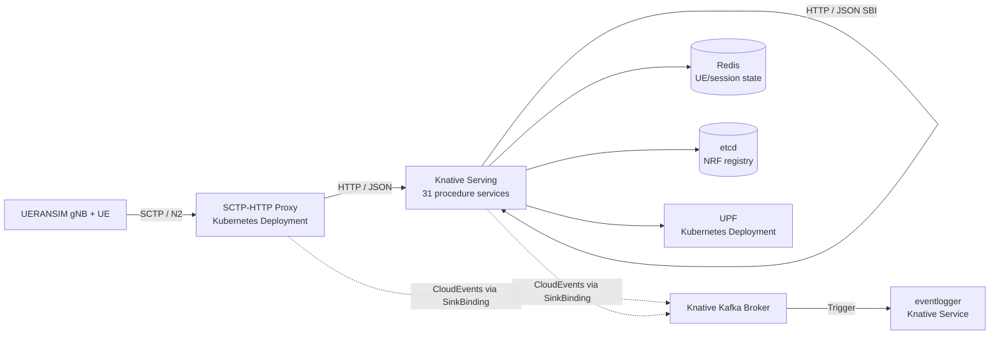

# Serverless5GC on Knative

Serverless5GC is a serverless 5G core network implementation using Procedure-as-a-Function decomposition on Knative. It maps 31 individual 3GPP procedures across 12 network functions (Release 15-17) to independent Knative Services that can scale to zero when idle.

**Paper:** [Serverless5GC: Private 5G Core Deployment via a Procedure-as-a-Function Architecture](https://arxiv.org/abs/2603.27618)

## Architecture

Each 3GPP procedure is packaged as a standalone HTTP container and deployed as a Knative Service. NF identity remains logical: for example, the AMF is a set of procedure services that share UE/session state in Redis.



## What Runs Where

Knative resources:

- 31 procedure functions as `serving.knative.dev/v1` Services.
- `eventlogger` as a Knative Service.
- Kafka-backed `eventing.knative.dev/v1` Broker.
- Trigger from the Broker to `eventlogger`.
- SinkBindings that inject `K_SINK` into procedure services and the SCTP proxy.

Kubernetes-native resources:

- Redis for UE/session/subscriber state.
- etcd for NRF registry state.
- UPF for PFCP/GTP-U.
- SCTP proxy for NGAP/SCTP on NodePort `31412`, forwarding to pod port `38412`.

## Runtime Changes

- Procedure handlers now use the local `pkg/function` runtime instead of an external FaaS SDK.
- Inter-procedure SBI calls use Knative service DNS by default:
  `http://<function>.<namespace>.svc.<cluster-domain>`.
- `FUNCTION_URL_TEMPLATE` can override the URL pattern. It must contain one `%s` placeholder.
- Function containers expose `/healthz` and `/metrics`.
- Invocation metrics are exported as:
  `serverless5gc_function_invocations_total`
  and `serverless5gc_function_duration_seconds`.
- When `K_SINK` is injected by SinkBinding, procedure services emit best-effort CloudEvents to the Kafka Broker.

## Images

The default image registry is:

```text
ghcr.io/atnog/serverless5gc-knative
```

Internal images:

- `ghcr.io/atnog/serverless5gc-knative/<procedure>:latest`
- `ghcr.io/atnog/serverless5gc-knative/sctp-proxy:latest`
- `ghcr.io/atnog/serverless5gc-knative/eventlogger:latest`

External images still used by native Kubernetes manifests:

- `redis:7-alpine`
- `quay.io/coreos/etcd:v3.5.12`
- `free5gc/upf:v4.2.0`

## Prerequisites

- Kubernetes or K3s with SCTP support enabled.
- `kubectl` configured for the target cluster.
- Docker or a compatible image builder.
- A Kafka cluster reachable from the Knative Kafka Broker.
- Knative Serving, Knative Eventing, and Knative Kafka Broker installed.
- `gtp5g` kernel module loaded on every node that may run the UPF.
- `/dev/net/tun` available on the UPF node. The UPF manifest mounts it and runs the UPF container privileged because the free5GC UPF creates GTP interfaces.

Prepare every node that may run the UPF:

```bash
sudo scripts/install-upf-node-prereqs.sh
```

For Arch-family nodes, including EndeavourOS, the script installs `base-devel`, `git`, `kmod`, and the matching kernel headers package. For Debian/Ubuntu nodes, it installs `build-essential`, `git`, `kmod`, and `linux-headers-$(uname -r)`.

The helper install script installs Knative Serving, Kourier, Eventing, and the Kafka Broker implementation. It does not install a Kafka cluster.

```bash
scripts/install-knative.sh
```

The default script version is `knative-v1.22.1`. Override versions when needed:

```bash
KNATIVE_VERSION=knative-v1.22.1 \
KAFKA_BROKER_VERSION=knative-v1.22.1 \
scripts/install-knative.sh
```

## Build Images

Build all 31 procedure images plus `sctp-proxy` and `eventlogger`:

```bash
deploy/knative/build-images.sh
```

Build and push to GHCR:

```bash
docker login ghcr.io
deploy/knative/build-images.sh \
  --registry ghcr.io/atnog/serverless5gc-knative \
  --tag latest \
  --push
```

Equivalent Make target:

```bash
make build-images
```

## Deploy

Deploy Redis, etcd, UPF, SCTP proxy, Knative Services, Broker, Triggers, and SinkBindings:

```bash
KAFKA_BOOTSTRAP_SERVERS=my-cluster-kafka-bootstrap.kafka:9092 \
scripts/deploy-knative.sh
```

Defaults:

- `REGISTRY=ghcr.io/atnog/serverless5gc-knative`
- `TAG=latest`
- `NAMESPACE=default`
- `CLUSTER_DOMAIN=cluster.local`
- `KAFKA_BOOTSTRAP_SERVERS=serverless5gc-kafka-bootstrap.kafka:9092`

Check readiness:

```bash
kubectl get ksvc
kubectl get broker,trigger,sinkbinding
kubectl get deploy,pod,svc
```

The SCTP/N2 endpoint is exposed as NodePort `31412` by the `sctp-proxy` Service, forwarding to NGAP/SCTP port `38412` in the pod. Point UERANSIM gNB `amfConfigs[].address` to a cluster node IP and `port` to `31412`.

If the UPF enters `CrashLoopBackOff` with empty logs, inspect pod events first:

```bash
kubectl describe pod -l app=upf
kubectl get pod -l app=upf -o wide
```

On the selected node, verify:

```bash
lsmod | grep gtp5g
test -c /dev/net/tun
```

If `/dev/net/tun` is missing, load the kernel module:

```bash
sudo modprobe tun
```

If `gtp5g` is missing, run the node prep script on that node and restart the UPF deployment:

```bash
sudo scripts/install-upf-node-prereqs.sh
kubectl rollout restart deployment/upf -n default
```

## Smoke Test

Run a basic in-cluster subscriber write and authentication initiation:

```bash
scripts/smoke-test-knative.sh
```

The smoke test uses `curlimages/curl`. Override it if your cluster uses a private mirror:

```bash
TEST_IMAGE=registry.local/curl:latest scripts/smoke-test-knative.sh
```

Inspect event delivery:

```bash
kubectl logs -l serving.knative.dev/service=eventlogger -c user-container --since=10m
```

## Provision Subscribers

For external provisioning through Knative ingress:

```bash
KNATIVE_DOMAIN=example.com \
KNATIVE_HTTP_PORT=80 \
eval/scripts/provision-subscribers.sh <knative-ingress-ip> 1000
```

For an in-cluster or port-forwarded direct URL:

```bash
FUNCTION_URL=http://udr-data-write.default.svc.cluster.local \
FUNCTION_HOST=udr-data-write.default.svc.cluster.local \
eval/scripts/provision-subscribers.sh 127.0.0.1 1000
```

## Run Evaluation

For Knative-only evaluation inside the Kubernetes cluster, install the bundled
Prometheus first:

```bash
scripts/install-monitoring.sh
```

This creates a `monitoring` namespace with Prometheus exposed at:

- in-cluster: `http://prometheus.monitoring.svc.cluster.local:9090`
- NodePort: `http://<node-ip>:30175`

It scrapes procedure function `/metrics` endpoints and kubelet cAdvisor metrics.

Run a cluster-local HTTP evaluation without an external load generator VM:

```bash
eval/scripts/run-knative-cluster-eval.sh low 1
```

Results are written to:

```text
eval/results/serverless-cluster/<scenario>/run<run>/
```

HTTP mode through Knative ingress:

```bash
MONITORING_IP=<prometheus-ip> \
LOADGEN_IP=<loadgen-ip> \
TARGET_AMF_IP=<knative-ingress-ip> \
KNATIVE_DOMAIN=example.com \
eval/scripts/run-scenario.sh low serverless 1
```

SCTP/NGAP mode through the native SCTP proxy:

```bash
MONITORING_IP=<prometheus-ip> \
LOADGEN_IP=<loadgen-ip> \
TARGET_AMF_IP=<node-ip> \
eval/scripts/run-scenario.sh low serverless-sctp 1
```

Cold-start storm:

```bash
SERVERLESS_IP=<node-ip> \
LOADGEN_IP=<loadgen-ip> \
eval/scripts/run-coldstart.sh low 1
```

## Project Structure

```text
serverless5gc/
├── cmd/
│   ├── eventlogger/          # CloudEvent log sink
│   ├── sctp-proxy/           # SCTP/NGAP to HTTP bridge
│   └── testgateway/          # Local integration-test gateway
├── functions/                # 31 procedure handlers
├── pkg/
│   ├── function/             # Knative HTTP runtime and CloudEvent emission
│   ├── sbi/                  # Knative service DNS client
│   ├── state/                # Redis/etcd state stores
│   └── ...
├── deploy/
│   ├── k3s/                  # Kubernetes-native Redis, etcd, UPF, SCTP proxy
│   ├── knative/              # Knative Dockerfiles, renderers, Eventing manifests
│   └── monitoring/
├── scripts/                  # Knative install/deploy/smoke-test helpers
├── eval/                     # Evaluation scenarios and scripts
└── test/integration/
```

## Useful Configuration

| Variable | Default | Used by |
|---|---|---|
| `FUNCTION_URL_TEMPLATE` | `http://%s.default.svc.cluster.local` | procedure functions, SCTP proxy |
| `FUNCTION_NAMESPACE` | `default` | procedure functions, SCTP proxy |
| `CLUSTER_DOMAIN` | `cluster.local` | procedure functions, SCTP proxy |
| `REDIS_ADDR` | `redis:6379` in manifests | stateful functions, SCTP proxy |
| `ETCD_ENDPOINT` | `etcd:2379` in manifests | NRF functions |
| `UPF_PFCP_ADDR` | `upf:8805` in manifests | SMF functions |
| `K_SINK` | injected by SinkBinding | CloudEvent producers |
| `KAFKA_BOOTSTRAP_SERVERS` | `serverless5gc-kafka-bootstrap.kafka:9092` | deployment script |

## References

- [Knative Serving YAML install](https://knative.dev/docs/install/yaml-install/serving/install-serving-with-yaml/)
- [Knative Eventing YAML install](https://knative.dev/docs/install/yaml-install/eventing/install-eventing-with-yaml/)
- [Knative Kafka Broker](https://knative.dev/docs/eventing/brokers/broker-types/kafka-broker/)
- [Knative SinkBinding](https://knative.dev/docs/eventing/custom-event-source/sinkbinding/)
- 3GPP TS 23.501/502, TS 24.501, TS 29.500-series, TS 38.413
